# ✦ SARIMO DESIGN

> Cinematic UI explorations, interface systems, motion studies, and visual experiments for the Sarimo ecosystem.

---

## Preview

<p align="center">
  
</p>

<p align="center">
  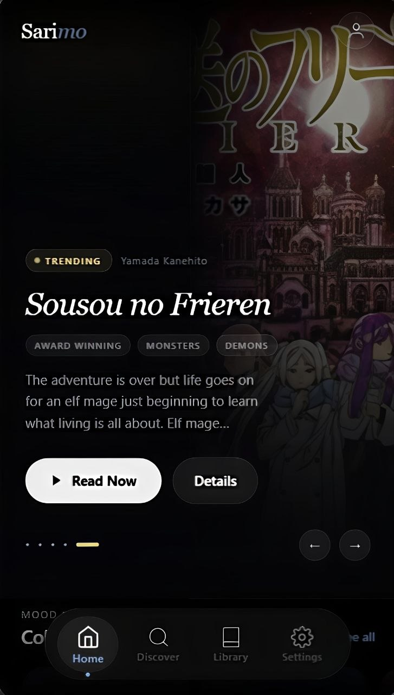
</p>

---

# ✦ About

Sarimo Design is the dedicated visual repository for:

* UI explorations
* Motion concepts
* Reader layouts
* Navigation systems
* Glass/soft-shadow experiments
* Typography systems
* Animation studies
* Design tokens
* Interface architecture

The goal is to create a reading experience that feels:

* cinematic
* immersive
* futuristic
* minimal
* calm
* responsive

---

# ✦ Design Language

## Core Principles

* Minimal visual clutter
* Smooth motion hierarchy
* Soft-shadow depth system
* Layered transparency
* Cinematic transitions
* Focused reading experience
* High readability
* Floating navigation patterns

---

# ✦ Screenshots

## Home

<p align="center">
  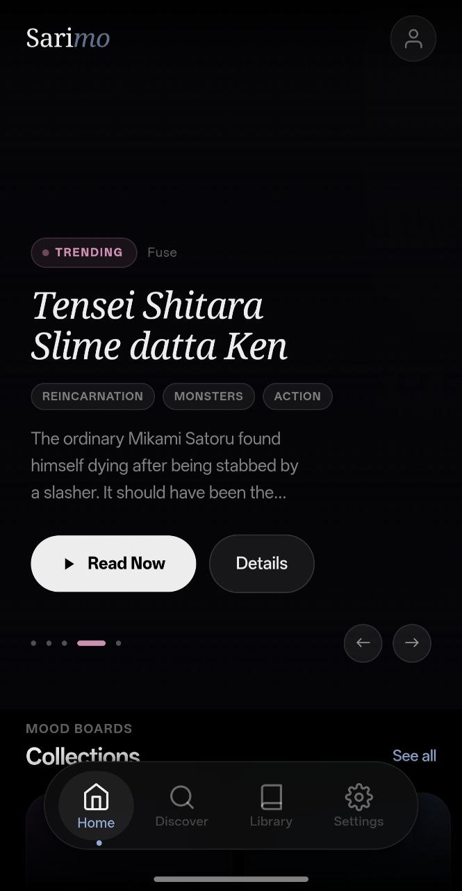
</p>

---

## Reader

<table align="center">
  <tr>
    <td align="center">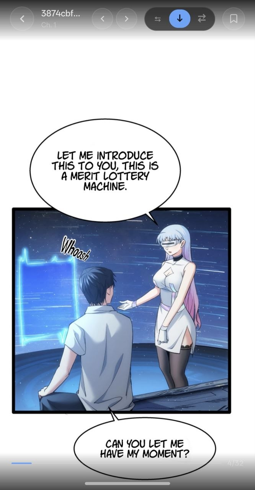</td>
    <td align="center">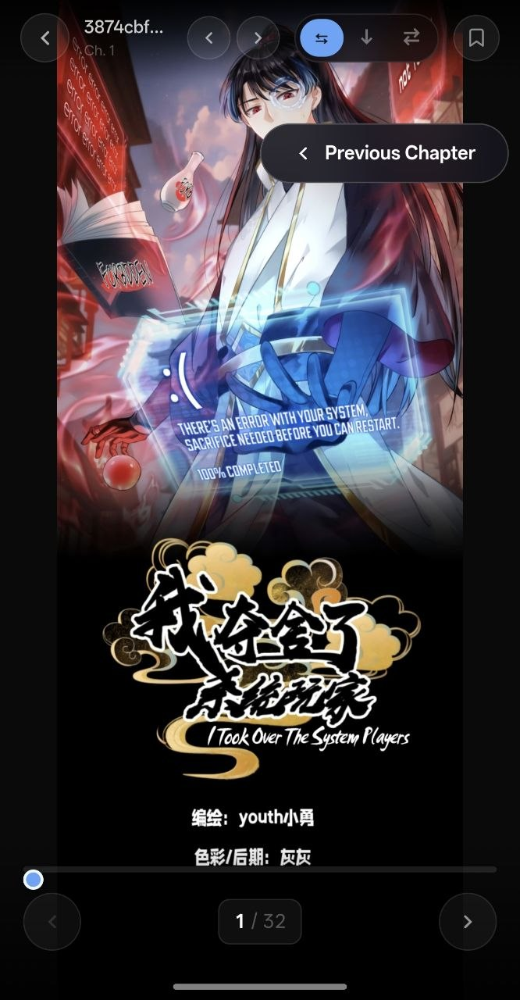</td>
  </tr>
</table>

---

## Discover

<p align="center">
  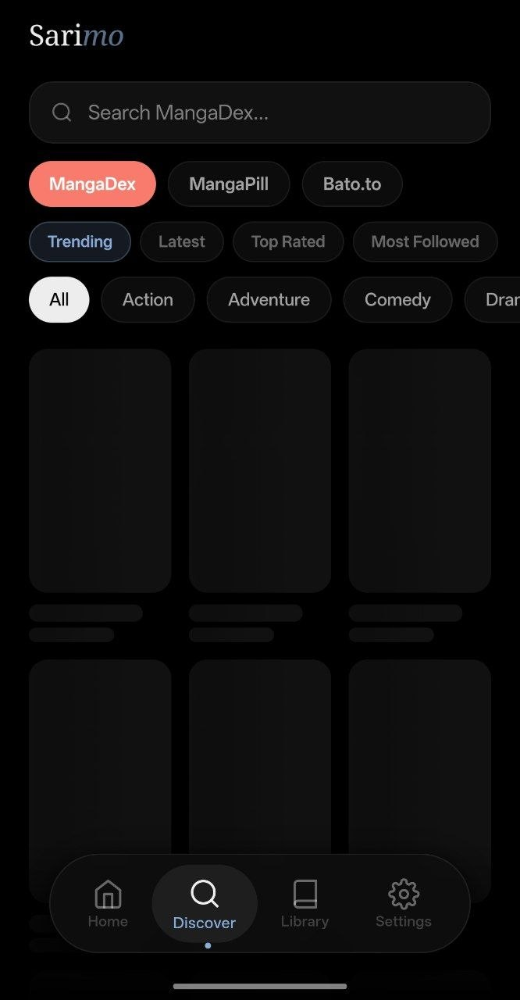
</p>

---

## Library & History

<div align="center">
  <div style="display: flex; gap: 15px; justify-content: center; flex-wrap: wrap;">
    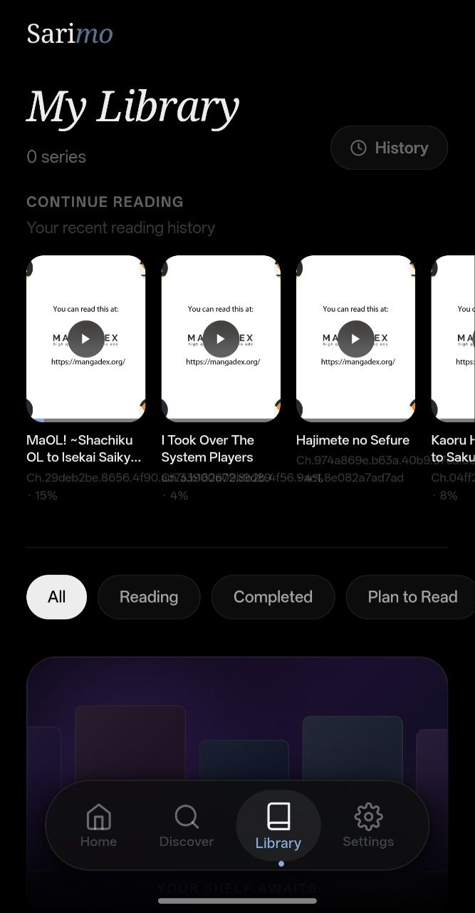
    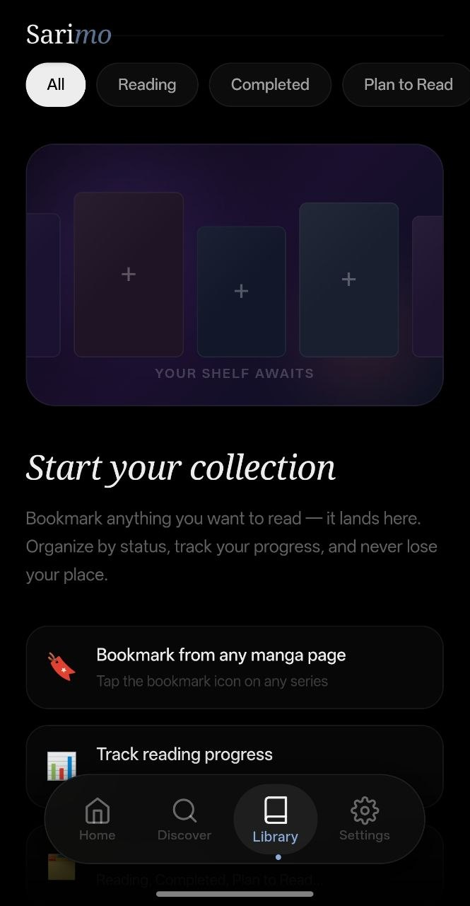
    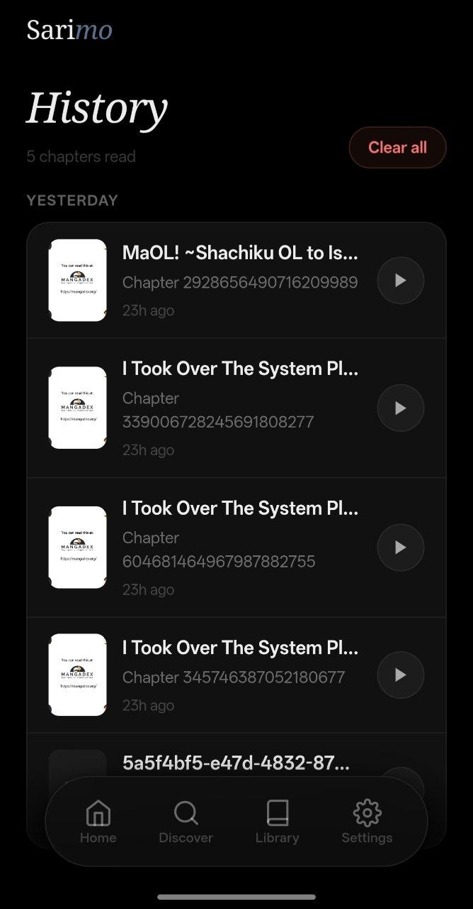
  </div>
</div>

---

## Reading Mode

<p align="center">
  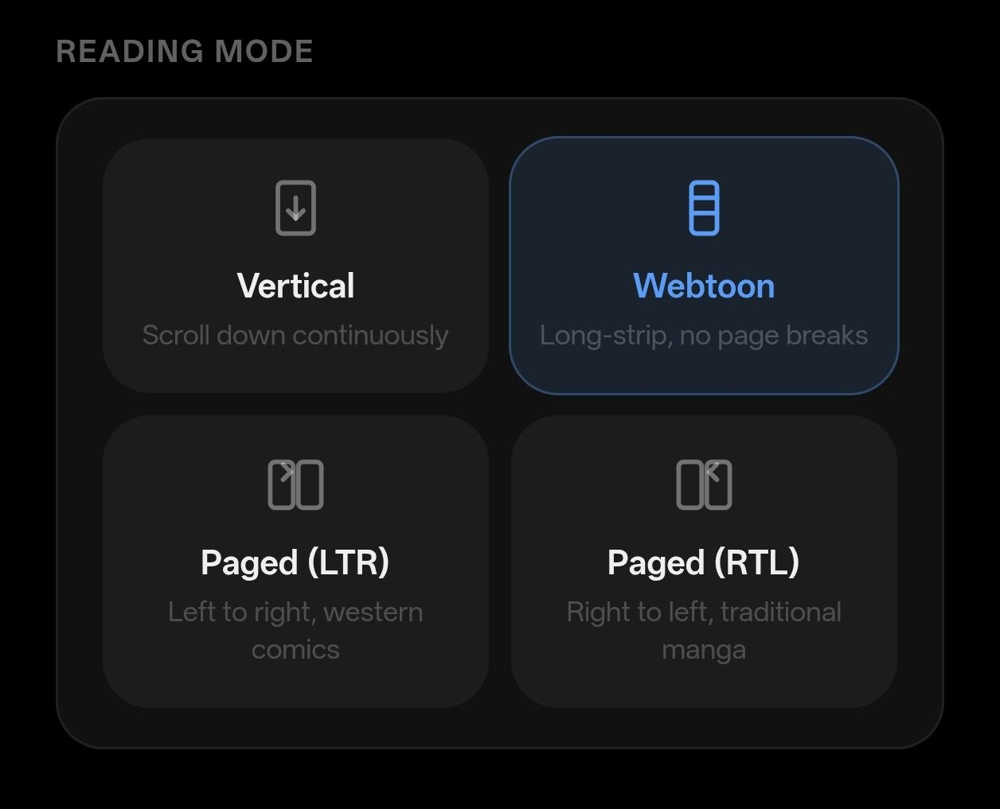
</p>

---

## Themes System

<p align="center">
  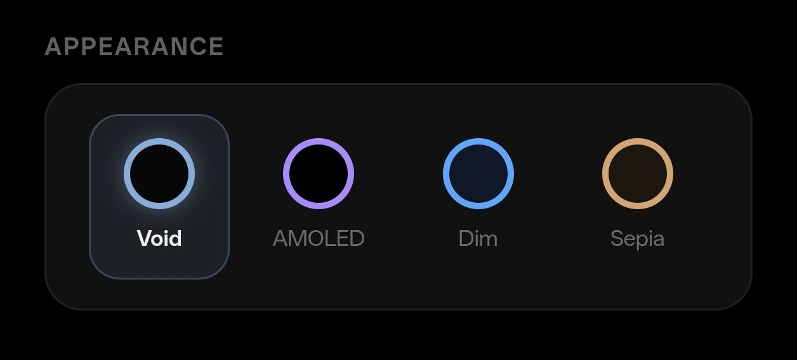
</p>

---

## Navigation System

<p align="center">
  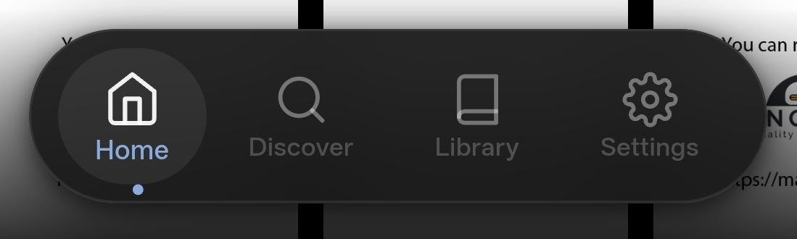
</p>

---

# ✦ Repository Structure

```txt
assets/
 ├── logo/
 ├── wallpapers/
 └── icons/

screenshots/
 ├── home.png
 ├── reader.png
 ├── discover.png
 ├── library.png
 └── navigation.png

mockups/
 ├── mobile/
 ├── tablet/
 └── experimental/

motion/
 ├── transitions/
 ├── interactions/
 └── prototypes/
```

---

# ✦ Current Focus

* Flutter UI migration planning
* Soft-shadow interface system
* Reader immersion improvements
* Motion refinement
* Responsive layouts
* Navigation fluidity
* Visual consistency

---

# ✦ Tech & Tools

* Figma
* Flutter
* Rive
* After Effects
* Photoshop
* Illustrator

---

# ✦ Philosophy

> "Designed to feel calm, immersive, and effortless."

<p align="center">
  <sub>SARIMO — Cinematic Reader Project</sub>
</p>
